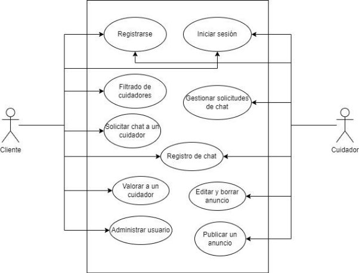

**Autor(es):**
- Del Río Pérez, Carlos
- Diañes Suárez, Daniel

|**Fecha** |**Versión** |
| - | - |
|24/02/2024|V1.0|

## Introducción
`	`Este documento tiene el objetivo de hacer una descripción más exhaustiva sobre los casos de uso core. Para ello, hemos utilizado un diagrama UML en el que se muestran los casos de uso con los que interactúa cada uno de los actores. Además, hacemos un análisis en el que definimos el actor, un resumen, unas precondiciones y postcondiciones y el flujo de los eventos de cada caso de uso.

## Diagrama UML de los casos de uso core

## Análisis de los casos de uso

|**Caso de uso**|CUC-01: Registro como cuidador|
| :- | :- |
|**Actores**|Cuidador|
|**Resumen**|El cuidador puede registrarse como usuario del sistema añadiendo los datos necesarios.|
|**Precondiciones**|Introducir los datos correctamente.|
|**Postcondiciones**|El cuidador queda registrado en el sistema.|
|**Flujo de eventos**|
1. El cuidador introduce sus datos en el formulario de registro.

2. El sistema comprueba que los datos son correctos y registra el usuario.

3. El cuidador ya es usuario del sistema.
|

|**Caso de uso**|CUC-02: Registro como cliente|
| :- | :- |
|**Actores**|Cliente|
|**Resumen**|El cliente puede registrarse como usuario del sistema añadiendo los datos necesarios.|
|**Precondiciones**|Introducir los datos correctamente.|
|**Postcondiciones**|El cliente queda registrado en el sistema.|
|**Flujo de eventos**|
1. El cliente introduce sus datos en el formulario de registro.

2. El sistema comprueba que los datos son correctos y registra el usuario.

3. El cliente ya es usuario del sistema.
|

|**Caso de uso**|CUC-03: Inicio de sesión como cuidador o cliente|
| :- | :- |
|**Actores**|Cuidador y cliente|
|**Resumen**|El cuidador o el cliente inicia sesión en el sistema introduciendo sus datos de usuario (email y contraseña).|
|**Precondiciones**|El usuario existe.|
|**Postcondiciones**|El usuario inicia sesión.|
|**Flujo de eventos**|
1. El usuario introduce los datos correctamente en el formulario de inicio de sesión.

2. El sistema comprueba que el usuario existe y las credenciales son correctas.

3. El usuario inicia sesión en el sistema.
|

|**Caso de uso**|CUC-04: Filtrado de cuidadores|
| :- | :- |
|**Actores**|Cliente|
|**Resumen**|Un cliente puede filtrar la lista de cuidadores por varios parámetros: fecha de publicación, precio/hora y localización.|
|**Precondiciones**|El cliente ha iniciado sesión en el sistema y selecciona algún parámetro de filtro.|
|**Postcondiciones**|El sistema devuelve una lista filtrada por los parámetros seleccionados.|
|**Flujo de eventos**|
1. El cliente selecciona los parámetros deseados para hacer el filtro.

2. El sistema devuelve una lista filtrada por los parámetros seleccionados.
|

|**Caso de uso**|CUC-05: Solicitar chat a cuidador|
| :- | :- |
|**Actores**|Cliente|
|**Resumen**|El cliente puede solicitar a un cuidador el acceso a un chat privado entre los dos.|
|**Precondiciones**|El cliente ha iniciado sesión en el sistema.|
|**Postcondiciones**|El cuidador recibe una solicitud de chat, la cuál podrá aceptar o rechazar.|
|**Flujo de eventos**|
1. El cliente solicita el chat.

2. El cuidador recibe la solicitud.
|

|**Caso de uso**|CUC-06: Gestionar solicitudes de chat|
| :- | :- |
|**Actores**|Cuidador|
|**Resumen**|El cuidador puede aceptar o rechazar las solicitudes de chat que tenga en la bandeja de entrada.|
|**Precondiciones**|Existe alguna solicitud de chat.|
|**Postcondiciones**|La solicitud queda aceptada o rechazada.|
|**Flujo de eventos**|
1. El cuidador selecciona una de las solicitudes de chat.

2. Si es aceptada, se abre un chat privado.

3. Si es rechazada, no se abre un chat privado.
|

|**Caso de uso**|CUC-07: Registro de chat|
| :- | :- |
|**Actores**|Cuidador y cliente|
|**Resumen**|Una vez se haya aceptado una solicitud de chat, el cuidador y el cliente pueden intercambiar mensajes.|
|**Precondiciones**|El cuidador ha aceptado la solicitud de chat.|
|**Postcondiciones**|Cliente y cuidador intercambian mensajes.|
|**Flujo de eventos**|
1. El cuidador recibe la notificación de la solicitud de chat aceptada y puede responder a los mensajes del cliente.

2. El cliente y el cuidador intercambian mensajes en tiempo real a través del chat.
|

|**Caso de uso**|CUC-08: Administrar usuario|
| :- | :- |
|**Actores**|Cuidador y cliente|
|**Resumen**|Todos los usuarios pueden realizar cambios y actualizaciones en la información de su perfil.|
|**Precondiciones**|
1. El usuario se ha registrado correctamente.

2. El usuario quiere modificar su información personal.
|
|**Postcondiciones**|Los cambios realizados en el perfil se guardan en el sistema.|
|**Flujo de eventos**|
1. El usuario accede a su perfil.

2. El usuario selecciona la opción de editar perfil.

3. El usuario realiza los cambios pertinentes.

4. El sistema valida los cambios realizados por el usuario.
|

|**Caso de uso**|CUC-09: Publicar un anuncio|
| :- | :- |
|**Actores**|Cuidador|
|**Resumen**|El cuidador puede publicar anuncios que describan sus servicios, experiencia, disponibilidad y tarifas.|
|**Precondiciones**|
1. El cuidador se ha registrado correctamente.

2. El cuidador quiere publicitar sus servicios.
|
|**Postcondiciones**|El anuncio del cuidador se muestra a los clientes potenciales en la plataforma.|
|**Flujo de eventos**|
1. El cuidador accede a la sección para publicar anuncios.

2. El cuidador completa toda la información del anuncio.

3. El cuidador publica el anuncio.

4. El anuncio se muestra a los clientes potenciales.
|

|**Caso de uso**|CUC-10: Editar y borrar un anuncio|
| :- | :- |
|**Actores**|Cuidador|
|**Resumen**|Los cuidadores pueden editar y borrar sus anuncios según sea necesario.|
|**Precondiciones**|El cuidador ha publicado algún anuncio.|
|**Postcondiciones**|Los cambios en el anuncio se guardan en el sistema.|
|**Flujo de eventos**|
1. El cuidador accede a la sección donde se encuentran sus anuncios publicados.

2. Si el cuidador elimina el anuncio, este se elimina del sistema y deja de aparecerle a los clientes potenciales.

3. Si el cuidador cambia la información del anuncio, este cambio se actualiza en el sistema.
|

|**Caso de uso**|CUC-11: Valoración de un cuidador|
| :- | :- |
|**Actores**|Cliente|
|**Resumen**|Los clientes pueden valorar el servicio prestado por los cuidadores mediante una escala de estrellas, como máximo 5.|
|**Precondiciones**|El cliente ha recibido servicios por el cuidador.|
|**Postcondiciones**|La valoración del cliente se registra en el sistema y aparece en el perfil del cuidador.|
|**Flujo de eventos**|
1. El cliente valora los servicios prestados por el cuidador.

2. Opcionalmente, el cliente añade comentarios sobre el servicio prestado por el cuidador.

3. El sistema guarda la valoración y comentarios del cliente.
|

