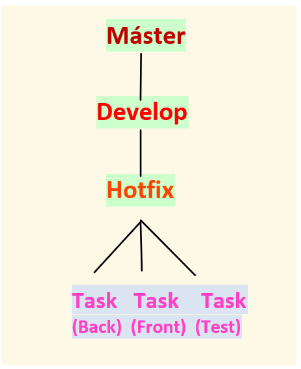

**Autor(es):** **[del Río Pérez, Carlos](./grupo)**

|**Fecha**|**Versión**|
| :-: | :-: |
|28/02/2024|v1.0|

## Introducción
En este documento se define la estrategia de ramas seguida por el grupo 9 de ISPP en el proyecto CuidaMe. Primero se explica el esquema de ramas que tenemos con la ayuda de una imagen y para terminar se define la estrategia que seguimos.

## Esquema de ramas

Como vemos en este esquema, tenemos tres grandes ramas: máster, develop y hotfix.
- Máster: rama principal con todo el código.
- Develop: rama previa antes de subir a máster, todo lo que se encuentre en esta rama debe esta testeado.
- Hotfix: rama en la que se unifica el trabajo de las ramas de cada subgrupo; backend, frontend y testing.

A partir de la rama hotfix se han creado otras tres ramas en las que se trabajan exclusivamente el backend, frontend y el testing en sus
respectivas ramas. Estas ramas contienen el trabajo ya terminado de cada tarea, teniendo una rama por tarea.

## Estrategia de ramas
- Las ramas task se crean a partir de máster excepto en el caso de las ramas task de testing ya que necesitan de backend para testearlo, así que se haría un pull de backend.
- Cuando una tarea se califica como “hecha” se hace una pull request a la rama correspondiente; backend, frontend o testing.
- Cuando todas las tareas de una rama backend, frontend o testing se han finalizado, se hace una pull request a hotfix.
- En hotfix una vez que se comprueba que todo el código funciona correctamente se hace una pull request a develop que debe ser aprobada por todos los líderes.
- Finalmente se sube de develop a máster.