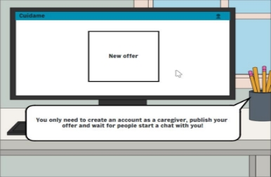

# Story Board

**Autor(es):**
- del Río Pérez, Carlos
- Pérez Romero, Lucía

|**Fecha**|**Versión**|
| :-: | :-: |
|31/03/2024|v1.0|

## Introducción

En este documento se muestran los dos storyboards realizados para CuidaMe: storyboard del cliente y el storyboard del cuidador.

## Storyboard (Cliente):

## Storyboard (Cuidador):

